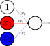
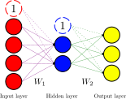
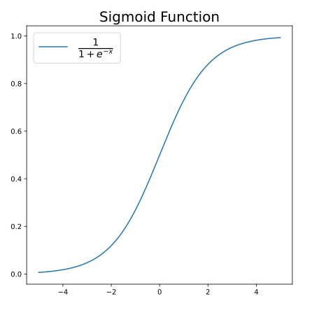
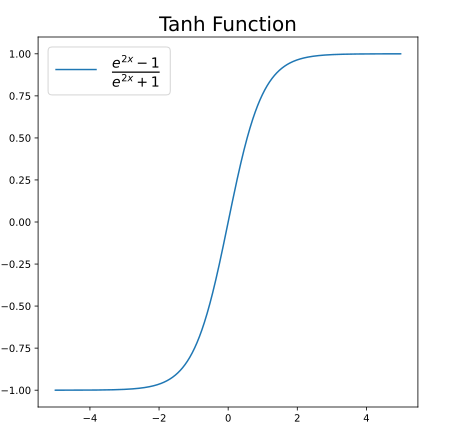
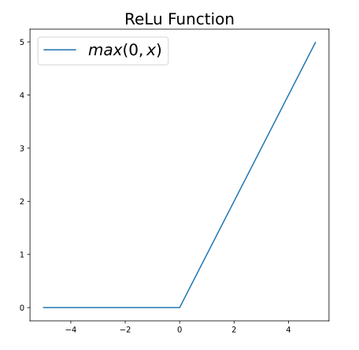
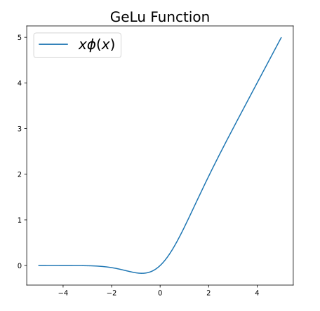
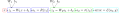


This is non-technical




With the help of some linear algebra and calculus, we can build upon our intuition of how neural networks work by understanding the math behind it.

## Overview of the Full Algorithm

Let's first get a brief outline of what all of the steps in the training process are.

1. Randomly initialize the weights of the neural network
2. Shuffle all of the training data
3. Perform a forward pass of the first training example
4. Perform the back propagation algorithm
    - a. Starting at the last layer, calculate the error term for the weights
    - b. Proceed to calculate the error term for all hidden layers (again, going from right to left)
    - c. Update the weights with gradient descent
5. Repeat steps 3 and 4 until you've iterated through the entire train dataset
6. Pass through all test data to guage if network is learning
6. Repeat step 2 through 6 for each epoch of training

The testing phase is when we give the trained network the test data, data it hasn't seen before, to guage how well it can generalize to new data. It performs a forward pass on each test example and compares the network's prediction to the ground truth for that test example.

After having gone through the entire test dataset, it calculates its accuracy. We want this metric to increase with each epoch, even more so than the accuracy on the training data.

*The weights of the network are not tuned when the test data is passed in!*

## Linear Algebra

Linear Algebra mathematics provides us with some minimalist notation and extra tools to properly utilize vectors and matrices. Take a look at the diagram of a neuron with two inputs again. 

The output of the neuron is the weighted sum of the inputs plus the bias term, passed into the activation function. Let's call it $$f(x)$$ for now.

$$output=f(w_0 + w_1x_1 + w_2x_2)$$

Let's now rewrite our inputs and weights as vectors.

$$
x =
\begin{bmatrix}
x_1\\
x_2
\end{bmatrix}
\\
w=
\begin{bmatrix}
w_1\\
w_2
\end{bmatrix}
$$

If we take the dot product of these two vectors, we get the sum of the element-wise products. We set $$b$$ to equal $$w_0$$ because it's the bias.

$$
\begin{align*}
x \cdot w &= w_1x_1 + w_2x_2\\
b &= w_0\\
output &= f(x \cdot w + b)\\
\end{align*}
$$

The weighted sum can now be written with just three variables because of the convenience of the dot product. The beauty here is that our notation doesn't change as the number of inputs increases. This operation&mdash;to multiply by the weights and add the bias&mdash;is called a linear transformation.

Let's move on to a neural network.

Our input, $$x$$, will be a vector of size four. The first bias will be a vector of size two, because there are two neurons in the hidden layer. Our weights for each neuron in the hidden layer will be represented as rows in a matrix, $$W_1$$. The super script represents what number neuron in the hidden layer we’re on. The subscript represents which number weight for that neuron. 

$$
W_1=
\begin{bmatrix}
w^{[1]}_1 & w^{[1]}_2 & w^{[1]}_3 & w^{[1]}_4\\
w^{[2]}_1 & w^{[2]}_2 & w^{[2]}_3 & w^{[2]}_4
\end{bmatrix}
$$

We have eight solid, purple lines and two dotted, purple lines in the diagram above, so we'll need eight elements in our weight matrix and two in our bias vector.

Arranging the weights like so allows us to use a neat property of matrix multiplication. When we multiply $$W_1$$ by $$x$$, we'll get a vector with a length of 2. Adding that to our bias vector, $$b_1$$, grants us the values for our hidden layer. Again, $$F(x)$$ is the activation function for the hidden layer.

$$
\begin{gather}
\text{hidden layer} = f(W_1x+b_1)\\
=f\left(
\begin{bmatrix}
w^{[1]}_1x_1 + w^{[1]}_2x_2 + w^{[1]}_3x_3 + w^{[1]}_4x_4\\
w^{[2]}_1x_1 + w^{[2]}_2x_2 + w^{[2]}_3x_3 + w^{[2]}_4x_4
\end{bmatrix}+
\begin{bmatrix}
w^{[1]}_0\\
w^{[2]}_0
\end{bmatrix}
\right)
\end{gather}
$$

The exact procrss is repeated to get the values for the output layer. The weight matrix for the output layer, $$W_2$$ will be a 3 x 2 matrix. Each row in $$W_2$$ represents the weights for each neuron in the output layer. Each column represents the a neuron from the hidden layer. The output layer will have a bias vector of length 3. Let's call the values in the hidden layer $$h$$ here. $$g(x)$$ is the activation function for the output layer.

$$\text{output layer} = g(W_2h+b_2)$$

As a rule of thumb, the dimensions for any given weight matrix will be the number of neurons in the current layer by the number of neurons in the previous layer. The length of the bias vector will be the number of neurons in the current layer.

## Activation Functions

Activation functions introduce non-linearaity to the neural network. This gives the network the ability to solve problems beyond those that a basic linear regression could solve. 

After the linear transformation for each layer, the result is then passed into that layer's activation function in order to get the layer's output.

### Sigmoid
The Sigmoid function is one of the most common activation functions. At 0, it's equal to 0.5 and as it approaches infinity, it asyptotes towards 1. As it approaches negative infinity, it approaches 0.

### Tanh

The Tanh function is very similar to the sigmoid, but its asymptote as it approaches negative infinity is -1.

### ReLu

The ReLu function, or the Rectified Linear Unit, is a unique one because of it's kink at 0. It's simply a piece wise function that returns 0 for all negative numbers and the number itself for all positive numbers. It essentially acts as a hard gate, letting all positive numbers through, but not negative ones.

### GeLu

The GeLu, or the Gaussian Error Linear Unit, aims to mirror the shape of ReLu, but avoids having the kink, making it differentiable everywhere. It's equal to $$x$$ times the Gaussian cumulative distribution function, which is represented by $$\phi$$.

&nbsp;
- - -
&nbsp;

Certain activation functions, such as the sigmoid or tanh functions, constrain the output to a specified range. This helps prevent some neurons from overpowering the rest of the network. However, given that functions such as the ReLu and GeLu are still very commonly used, this is not a strict requirement.

Activation functions also need to be differentiable. This allows us to calculate the gradients of the cost function and minimize it. The ReLu is unique because it's clearly not differentiable at 0, but we just manually set the derivative there to be 0.

I won't derive each of the derivatives by hand, but I've inserted them below.

$$
\begin{align*}
\sigma'(x)&=\sigma(x)(1-\sigma(x))\\
\tanh'(x)&=1-tanh^2(x)\\
ReLu'(x)&=\begin{cases}
        0 & \text{if } z_1 \leq 0\\
        1 & \text{if } z_1 > 0
    \end{cases}\\
GeLu'(x)&=\phi(x)+xP(X=x)
\end{align*}
$$

As a side note, $$P(X=x)$$ is the value of the PDF of the standard normal curve at $$x$$.

One useful feature of the derivatives for the sigmoid and tanh functions is that the derivative is just a function of the output, which makes calculating the derivatives really simple.

### Softmax

Another activation function I want to mention is the softmax function. It doesn't have a graph, because its input is a vector of the layer's neurons.

$$S(x)=\frac{e^{x_i}}{\sum^{N}_{k=1}e^{x_k}}$$

The useful feature of the softmax activation function is that all of the values now add up to 1, allowing us to interpret the result as probablities. This is useful for multiclass classification problems.

We won't dive into the derivative of this function here because it requires the Jacobian matrix as its a function that takes in a vector and output a vector. The other activation functions simply took in a number and returned one as well.

&nbsp;
- - -
&nbsp;

There are many functions I haven't mentioned, but if you're interested, look further into the Binary Step function, Leaky ReLu, ELU, SoftPlus, Swish, and many more not listed here.

There's not one activation function that rules above all else. It's usually dependant on the specific use case. I would recommend starting with the ReLu for the hidden layers and the softmax activation function for the output layer. Then, taking into account factors such as accuracy of the network and training speed, see if modifying the activation functions yield any improvements.

## Forward Pass

Now that we got our basic building blocks, let’s put them all together for a example forward pass: passing in our input and calculating our output.

Let's use the network from above, but add the ReLu activation function, $$R(x)$$ to the hidden layer and the sigmoid activation function, $$\sigma(x)$$, to the output layer. We start off with our input, $$x$$.

$$
\begin{align*}
z_1&=W_1x+b_1\\
a_1&=R(z_1)\\
z_2&=W_2a_1+b_2\\
\text{output}&=\sigma(z_2)
\end{align*}
$$

The key insight to gather here is the entire network is a bunch of nested functions. The result of the first linear transformation with $$W_1$$ and $$b_1$$ is the input for the ReLu function. The result of the ReLu function is the input for the second linear transformation, and so on.

The neuron with the highest value in the output layer is considered our prediction.

If we really wanted to, we could write the whole network on one line. It's probably clear why we don't though. It'll get really messy as the number of layers increases.

$$\text{output layer}=\sigma(W_2(R(W_1x+b_1))+b_2)$$

This will come in handy when we start to calculate the derivatives soon.

## Cost functions

After a forward pass for one training example, we pass the values of the output layer (our predicted values) into a cost function, along with the true values for that data point. The cost function then returns a number indicating how "incorrect" the prediction is. The higher the output is, the more incorrect our predictions are relative to the ground truth.

Assume the first input to the loss fucntion is our prediction and the second the ground truth.

$$
\mathcal{L}\left(
    \begin{bmatrix}
        0.78\\
        0.05\\
        0.12
    \end{bmatrix},
    \begin{bmatrix}
        1\\
        0\\
        0
    \end{bmatrix}
\right) >
\mathcal{L}\left(
    \begin{bmatrix}
        
        0.23\\
        0.59\\
        0.07
    \end{bmatrix},
    \begin{bmatrix}
        0\\
        0\\
        1
    \end{bmatrix}
\right)
$$

The goal of training is to minimize our cost function across all training examples. This means we need a way to measure how different our predictions are from the ground truth and it needs to be differentiable.

### MSE

The most basic cost function is the Mean Squared Error loss. 

$$MSE=\frac{1}{N}\sum^{N-1}_{k=0}\left(y_k - \hat y_k\right)^2$$

We're taking our prediction vector and subtracting it from our ground truth, squaring it, and summing up across all training examples. Check out my post about linear regresssion [here](./linear-regression) for a deeper intuition as to what exactly is happening.

For a singular training example, we'll be minimizing the following:

$$\frac{\left(y-\hat y\right)^2}{2}$$

The $$2$$ on the bottom will cancel out when we take the derivative of the function, which is $$-(y-\hat y)$$.

## Backward prop

This is the complicated part of a neural network, the training process. I’ve redrawn the neural network from above in a slightly different manner. This format will help us understand the calculus more easily.

The colors represent each layer and each rectangle represents an operation that’s performed in the network. The output of one function is the input for the next one. We pass $$x$$ into the first linear transormation into, $$z_1(x, W_1, b_1)$$, then into the ReLu activation function, then into the second linear transformation, $$z_2(a_1, W_2, b_2)$$, then into the sigmoid activation function, and finally into the loss function to calculate the error.

This extends the insight of how a neural network is a bunch of nested functions.

### Chain Rule Review

Imagine we're trying to find the derivative of $$h(x)$$, which is comprised of two functions, one nested in the other, i.e. $$h(x)=f(g(x))$$, or the output of $$g(x)$$ is the input of $$f(x)$$.

Let's say $$f(x)$$ and $$g(x)$$ are equal to the equations below.

$$
\begin{align*}
f(x)&=x^2\\
g(x)&=5x+3\\
h(x)&=(5x+3)^2
\end{align*}
$$

The chain rule dictates how to take the derivative of nested functions; You derive the outer one, while treating the inner function as a variable. Then, you multiply the result by the derivative of the inner function. So the derivative of $$h(x)$$ is $$f'(g(x))g'(x)$$. In other words, $$\frac{dh}{dx}=\frac{df}{dg}\frac{dg}{dx}$$.
$$
\begin{align*}
f'(x)&=2x\\
g'(x)&=5\\
h'(x)&=2(5x+3)*5\\
&=10(5x+3)\\
&=50x+30
\end{align*}
$$

### Partial Derivatives Review

Let's say we have the following equation, $$f(x) = x^2y$$. Partial derivatives represent the change in the output of the equation when one of the input variables are changed by a small amount. The partial derivative of $$f(x)$$ is how the output of the function will be affected when changing $$x$$ by a small while keeping $$y$$ constant. The partial derivative with respect to $$y$$ is how the output of the function will be affected when changing $$y$$ by a small while keeping $$x$$ constant. 

To calculate the partial derivatives, we take the derivative like normal, but pretend one of the variables is just like any other constant.

$$
\begin{align*}
\frac{\partial f}{\partial x}&=2xy\\
\frac{\partial f}{\partial y}&=x^2
\end{align*}
$$

When we stack all of the partial derivatives into a vector, we call that the gradient vector of a function.
$$\nabla f=
\begin{bmatrix}
2xy\\
x^2
\end{bmatrix}
$$

There are four values in total we want to calculate, $$\frac{\partial \mathcal{L}}{\partial W_1}$$, $$\frac{\partial \mathcal{L}}{\partial b_1}$$, $$\frac{\partial \mathcal{L}}{\partial W_2}$$, and $$\frac{\partial \mathcal{L}}{\partial b_2}$$.

These are the four parameters of our network, the ones we want to optimize. We can now use the chain rule to write the equations for each of these.

$$
\begin{align*}
\frac{\partial \mathcal{L}}{b_2}&=\frac{\partial \mathcal{L}}{\partial a_2}\frac{\partial a_2}{\partial z_2}\frac{\partial z_2}{\partial b_2}\\
\frac{\partial \mathcal{L}}{W_2}&=\frac{\partial \mathcal{L}}{\partial a_2}\frac{\partial a_2}{\partial z_2}\frac{\partial z_2}{\partial W_2}\\
\frac{\partial \mathcal{L}}{b_1}&=\frac{\partial \mathcal{L}}{\partial a_2}\frac{\partial a_2}{\partial z_2}\frac{\partial z_2}{\partial a_1}\frac{\partial a_1}{\partial z_1}\frac{\partial z_1}{\partial b_1}\\
\frac{\partial \mathcal{L}}{b_1}&=\frac{\partial \mathcal{L}}{\partial a_2}\frac{\partial a_2}{\partial z_2}\frac{\partial z_2}{\partial a_1}\frac{\partial a_1}{\partial z_1}\frac{\partial z_1}{\partial W_1}
\end{align*}
$$

If you look closely, you'll see a lot of repeated partials across all of the equations, such as the product $$\frac{\partial \mathcal{L}}{\partial a_2}\frac{\partial a_2}{\partial z_2}$$. This is conveient for us because it means we can just compute them once and store them for later use.

Just as a reminder, $$\frac{\partial a_1}{\partial z_1}$$ and $$\frac{\partial a_2}{\partial z_2}$$ are just the derivatives of the ReLu and sigmoid functions, respectively.

### Calculating the Partials

The premise of the back propagation algorithm is that we need to take the partial derivative of the cost function with respect to each of the weight matrices and bias vectors. Given that the loss function is comprised of several nested functions, we'll be needing to utilize the chain rule throughout our computations.

In order to calculate all of the partials, we'll need to find the derivatives of each of the cells in our diagram from above. Then, we'll need to multiply the appropriate results for each partial we're trying to find.

Let's start off with our cost function, Mean Squared Error. Because $$\hat y$$ is the value that's dependant on our weights and biases, we want to take the partial derivative with respect to that.

$$
\begin{align*}
\mathcal{L}(a_2)&=\frac{(y-a_2)^2}{2}\\
\frac{\partial \mathcal{L}}{\partial \hat y}&=-(y-a_2)
\end{align*}
$$

Moving on to the derivative of the sigmoid. We've already seen it, but here it is one more time.

$$\sigma'(z_2)=\sigma(z_2)(1-\sigma(z_2))$$

Now, let's calculate the partial of the second linear transformation, $$W_2a_1+b_2$$, with respect to $$W_2$$ because we want to optimize our weight matrices. It's just $$a_1$$. The partial with respect to our bias vector is just $$1$$. And our partial with respect to $$a_1$$ is $$W_2$$; We'll need this partial as we propagate further back for $$W_1$$ and $$b_1$$.

We have all of the pieces of our equation to write the complete partial derivatives for $$W_2$$ and $$b_2$$.

$$
\begin{align*}
\frac{\partial \mathcal{L}}{W_2}&=\frac{\partial \mathcal{L}}{\partial a_2}\frac{\partial a_2}{\partial z_2}\frac{\partial z_2}{\partial W_2}\\
\frac{\partial \mathcal{L}}{\partial a_2}&=-(y-a_2)\\
\frac{\partial a_2}{\partial z_2}&=\sigma'(z_2)\\
\frac{\partial z_2}{\partial W_2}&=a_1\\
\frac{\partial \mathcal{L}}{W_2}&=-(y-a_2)\sigma'(z_2)a_1
\end{align*}
$$

The partial with respect to our bias is very similar.
$$
\begin{align*}
\frac{\partial \mathcal{L}}{b_2}&=\frac{\partial \mathcal{L}}{\partial a_2}\frac{\partial a_2}{\partial z_2}\frac{\partial z_2}{\partial b_2}\\
\frac{\partial z_2}{\partial b_2}&=1\\
\frac{\partial \mathcal{L}}{b_2}&=-(y-a_2)\sigma'(z_2)
\end{align*}
$$

The derivative of the ReLu function is a little bit unorthodox as we saw above.

$$
\frac{\partial R}{\partial z_1}=
    \begin{cases}
        0 & \text{if } z_1 \leq 0\\
        1 & \text{if } z_1 > 0
    \end{cases}
$$

And the derivatives of the first linear transformation is the same as the one previously computed. The derivative with respect to $$W_1$$ is $$x$$ and the derivative with respect to $$b_1$$ is $$1$$.

$$
\begin{align*}
\frac{\partial \mathcal{L}}{W_1} &= \frac{\partial \mathcal{L}}{\partial a_2}\frac{\partial a_2}{\partial z_2}\frac{\partial z_2}{\partial a_1}\frac{\partial a_1}{\partial z_1}\frac{\partial z_1}{\partial W_1}\\
\frac{\partial z_2}{\partial a_1} &= W_2\\
\frac{\partial a_1}{\partial z_1} &= \begin{cases}
        0 & \text{if } z_1 \leq 0\\
        1 & \text{if } z_1 > 0
    \end{cases}\\
\frac{\partial z_1}{\partial W_1} &= x\\
\frac{\partial \mathcal{L}}{W_1}&=-(y-a_2)\sigma'(z_2)W_2R'(z_2)x
\end{align*}
$$

$$
\begin{align*}
\frac{\partial \mathcal{L}}{b_1}&=\frac{\partial \mathcal{L}}{\partial a_2}\frac{\partial a_2}{\partial z_2}\frac{\partial z_2}{\partial a_1}\frac{\partial a_1}{\partial z_1}\frac{\partial z_1}{\partial b_1}\\
\frac{\partial z_1}{\partial b_1} &= 1\\
\frac{\partial \mathcal{L}}{b_1}&=-(y-a_2)\sigma'(z_2)W_2R'(z_2)
\end{align*}
$$

Need to add the circle notation and the concept of "error term".

$$
\begin{align*}
\end{align*}
$$



