Linear regression is a machine learning algorithm used to predict an output value based on a set of input values. For example, if we’re trying to predict housing prices during the pandemic, we might look at values of various houses for which we have data for.

Some variables of interest might be square footage, number of bedrooms, number of bathrooms, the inflation in the area, etc. In this case, the price of each house would be the dependent variable, or the variable we’re trying to predict. The remaining variables are known as the independent variables. These variables will help us try to predict the dependent variable.

This is what some sample data might look like.

| Square footage | # of bedrooms | # of bathrooms | Distance to nearest school | Crime rate (per 100k population) | Price of house |
| --- | --- | --- | --- | --- | --- |
| 3,200 sqft | 3 | 2 | 1.5 mi | 98 | $400,000 |
| 1,800 sqft | 2 | 2 | 1.8 mi | 100 | $325,000 |
| 2,250 sqft | 2 | 1 | 0.8 mi | 67 | $350,000 |
| 1,200 sqft | 1 | 1 | 2.2 mi | 12 | $120,000 |
| 1,500 sqft | 2 | 2 | 2.4 mi | 45 | ??? |

*How can we best predict the price of the final house given the data for the preceding houses?* is the question we're trying to solve.

Naturally, instead of a human diving into the data and trying to figure out the numbers, we’re delegating it to the machine that can do it much more efficiently and deterministically.

One might ask, how exactly does a computer achieve this? Believe it or not, the answer is quite intuitive, even without looking at any math.

Let’s take a simpler, two-dimensional example that we can graph. Say we have the following points that we’re trying to fit a line to.

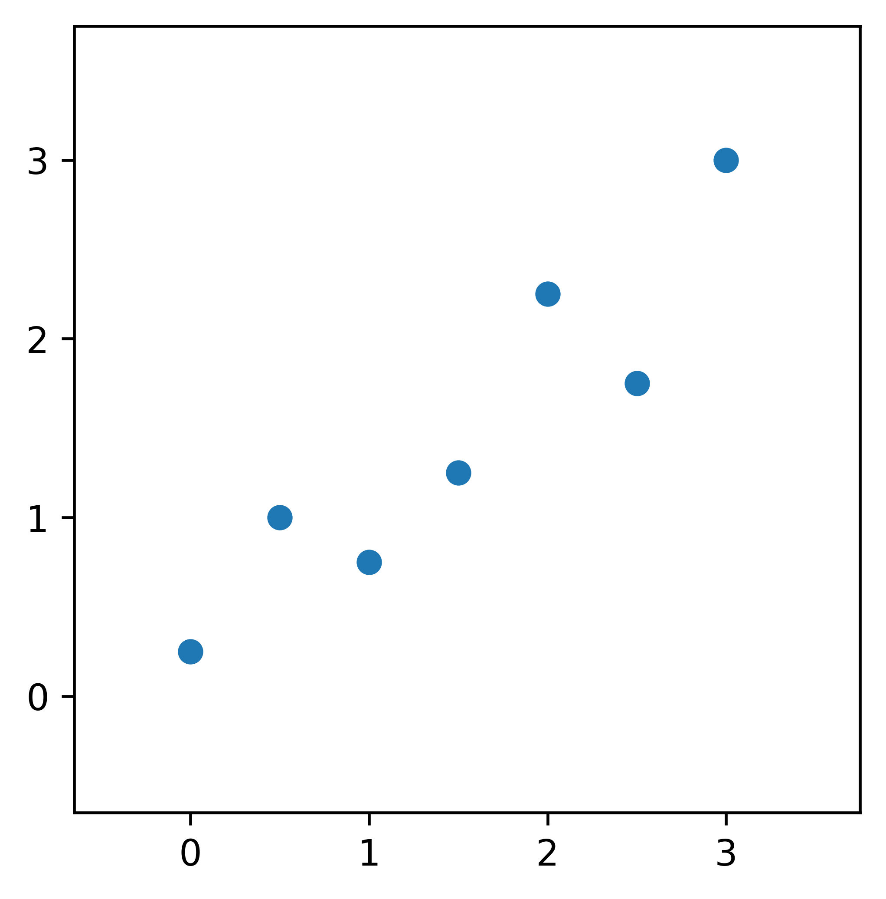

To measure the best line to fit through all these points, we need some sort of numeric metric that’s objective and allows us to compare different lines. We are looking for a line that doesn’t necessarily go through all the points, or any for that matter. We want a line that, holistically, is the best fit for all the points, not just some.

Let's clarify what "best fit" means. If each data point is regarded as the ground truth, then the y-coordinate of the line is our predicted value for that specific x-value.

The line is a function that when given an x-value, will output a y-value. We want to make sure our predictions are as accurate to the entire data set as possible.

Which of the following lines is the better fit, i.e., predicts the data more accurately? How did you know?

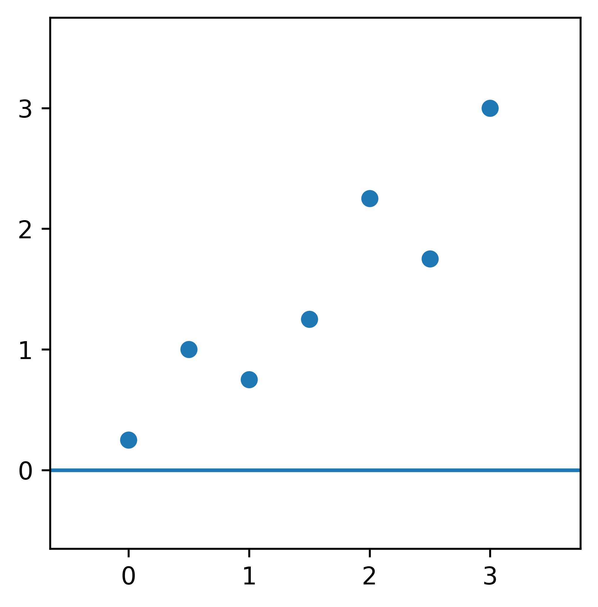

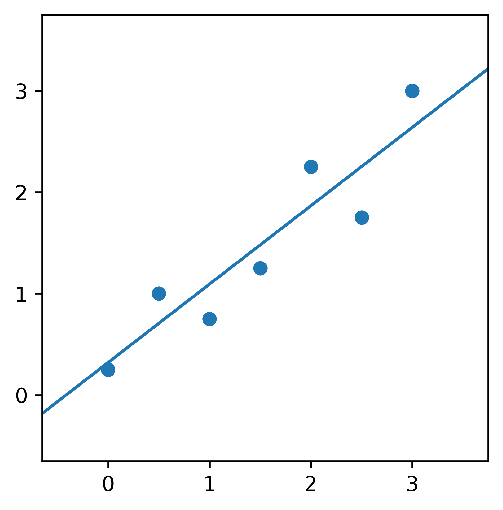

Given that this is quite a stylized example, it’s quite easy and objective to determine which one is the better line.

What about this one?

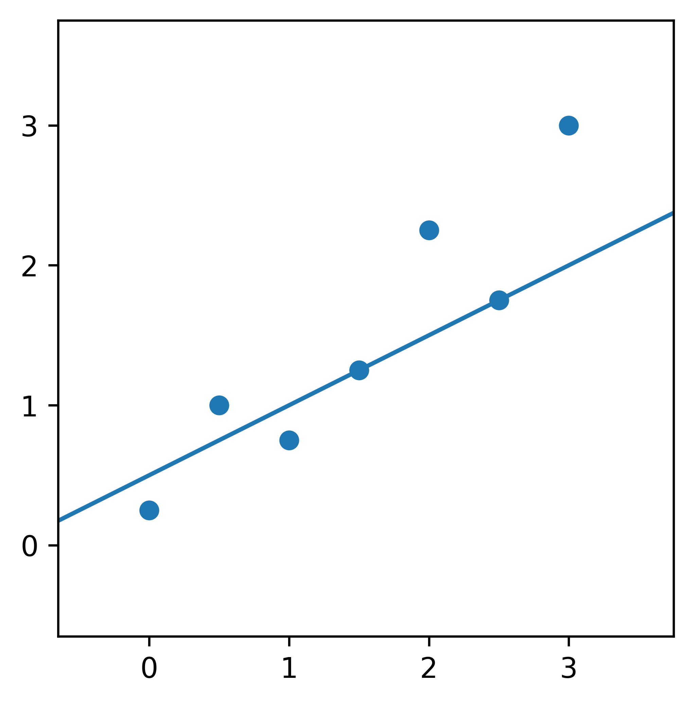

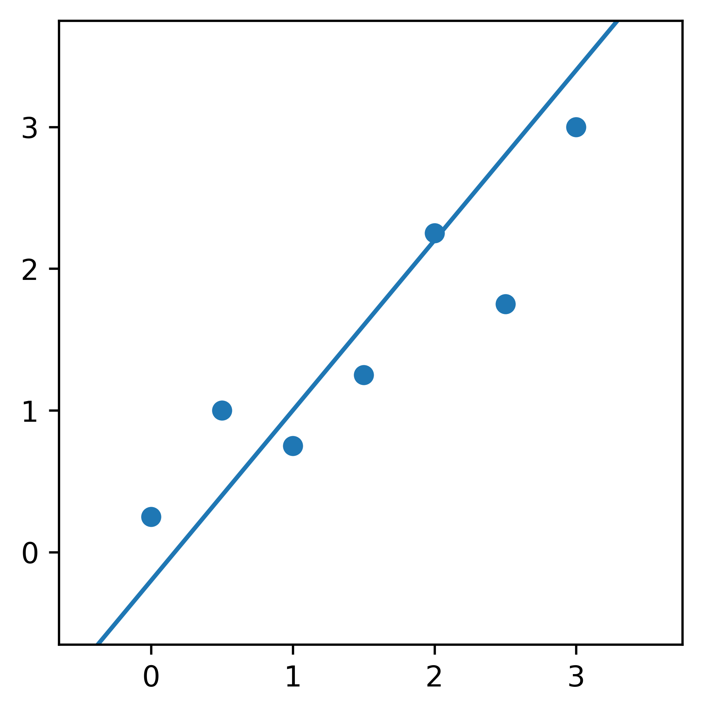

This example is much more subjective. Thus, it’s imperative for us to have a metric to compare lines.

One common metric is called Ordinary Least Squares. One draws a line from each point (the original data point) straight up or down to the line (the predicted value). This distance represents the error of the model, i.e., the line.

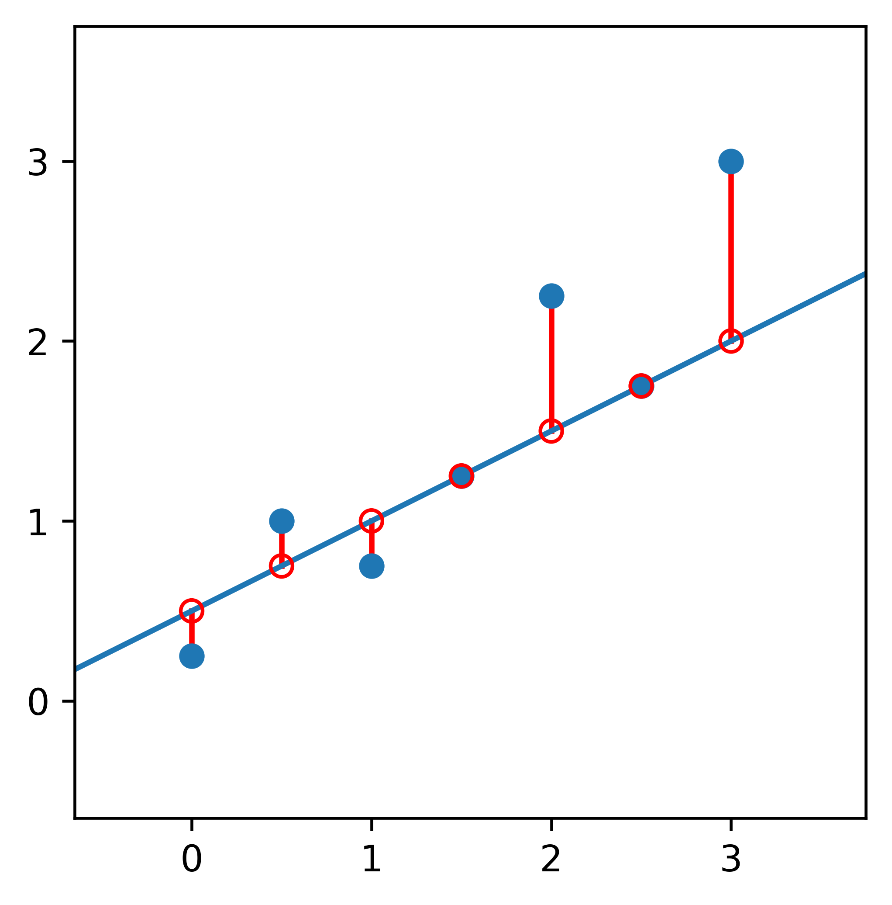

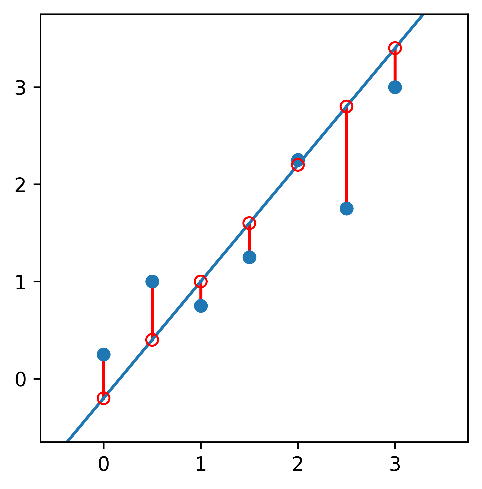

For each point, we just take the predicted value (the y-coordinate of the red circles on the line) and subtract it from the actual value (the y-coordinate of the blue points).

Before we sum everything up to measure our error, we have to remember that some of the lengths will be negative when our predicted value is less than the actual value, i.e., the point is above the line.

A negative error doesn't make sense. If we add up all the lengths, we would be cancelling out some of our error, resulting in an inaccurate metric. We square each error before summing up across all points to accommodate for this.

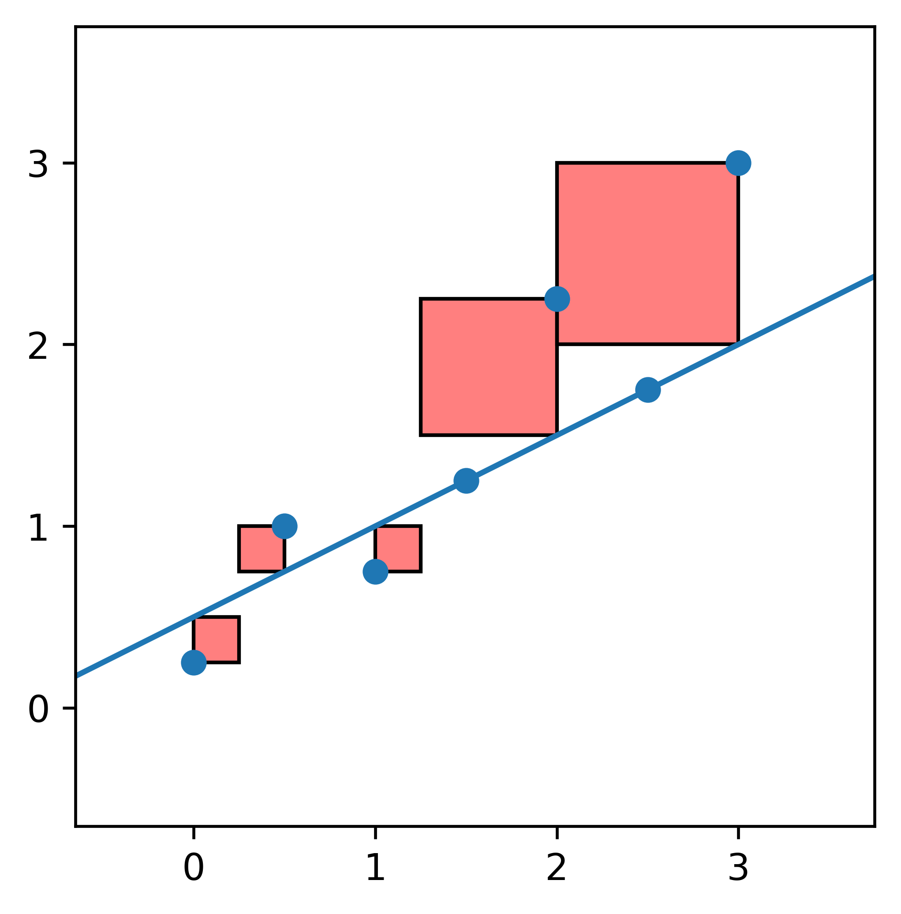

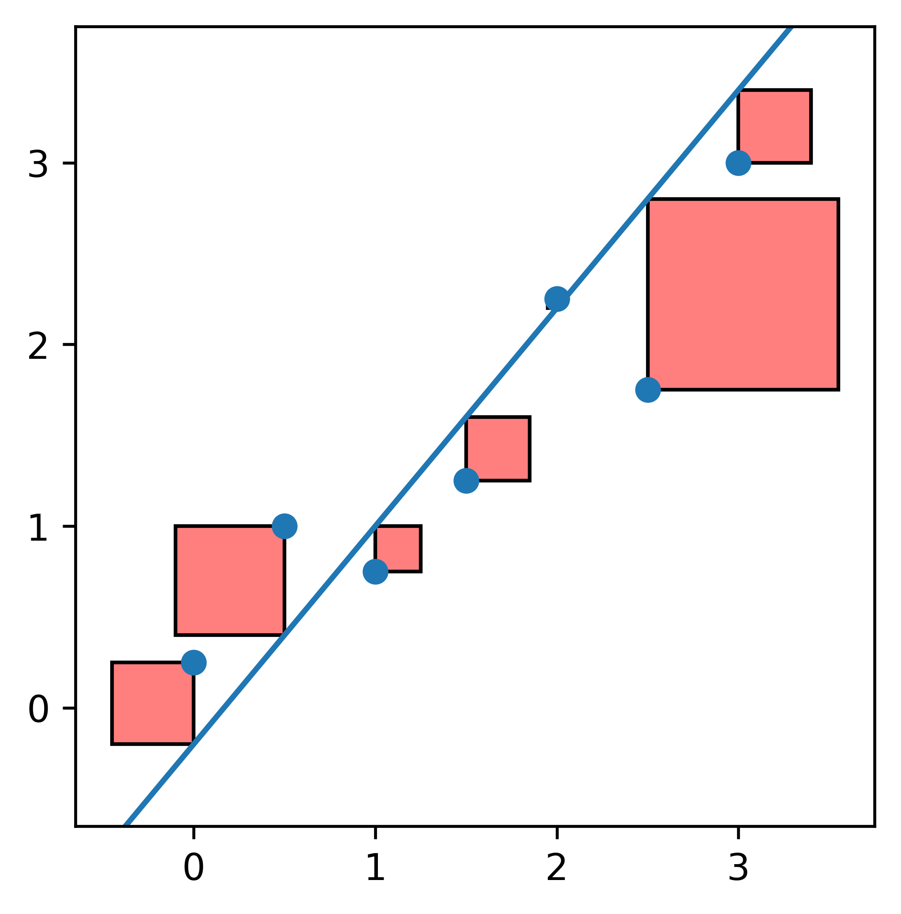

Each square represents the error of its associated point. The larger the square, the further away the point is from the line.

Thus, the line with smaller squares overall is the line that tends to better predict the values from the original dataset; This is the line with less error, holistically.

After summing up the areas, we get that the one on the left has a combined area of 2.01, while the one on the right is only 1.75! We prefer the latter.

The next question you might be asking yourself is: Hey, neither of those above lines seem like the most optimal one. How can we calculate that?

This is where the machine learning algorithm called Gradient Descent comes in. An animation of the process is inserted below. Its second half is sped up because the algorithm makes smaller and smaller changes as the line gets closer and closer to optimal.

The line begins with a slope and y-intercept of zero.

<video playsinline autoplay muted loop>
    <source src="../assets/images/lr/lr-anim.mp4" type="video/mp4">
</video>

This algorithm also extends to lines of higher degrees (again, sped up).

<video playsinline autoplay muted loop>
    <source src="../assets/images/lr/quad.mp4" type="video/mp4">
</video>

<video playsinline autoplay muted loop>
    <source src="../assets/images/lr/cubic.mp4" type="video/mp4">
</video>

What's happening here is, given a starting line, we tell the computer to move the line in a direction that minimizes the sum of the errors (a.k.a. the combined area of the squares).

This step is done by defining a cost function that takes in the parameters defining the line and using gradients (yay calculus) to minimize the total error iteratively. This means after each iteration, the line is a little bit more accurate to the dataset. Over time, the algorithm should converge to the optimal weights.

Click the technical link above to learn more! Beware, there will be math involved.

split

Let's open the black box of linear regression a bit more by getting our hands dirty with the math. We will be needing linear algebra and a little bit of calculus.

I'll be assuming that the reader is familiar with the following topics:

- basic linear algebra
- matrix/vector multiplication
- dot product
- gradients

The algorithm to minimize a cost function iteratively is called Gradient Descent. For each iteration, we calculate which direction to travel in that decreases our output. We repeat this process until the algorithm converges, i.e., we've found a local minima. Don't worry if this doesn't make sense yet.

Any line has two parameters, its slope and a constant term, or  the intercept. From the familiar equation $$y=mx+b$$, $$m$$ and $$b$$ are the parameters of our model. We can tune those to move the line around.

From now on, let's write the equation for our line as $$y=w_0 + w_1x$$. $$w_0$$ is our new intercept term and $$w_1$$ the slope.

Let's say we're given $$n$$ data points represented as $$(x_i, y_i)$$, where $$0\le i <div n$$. This means $$i$$ represents the data point's index. Our goal is to find the optimal weights, $$w_0$$ and $$w_1$$, based on the input data.

Let's first represent our data as a matrix, $$X$$. We call each column a "feature". In the house prices example from the non-technical section, a feature might be the number of bathrooms in a house or its square footage. Each would be a column in the $$X$$ matrix.

$$
X =
\begin{bmatrix}
1 & x_0    \\
1 & x_1  \\
\cdots & \cdots\\
1 & x_{n-2}\\
1 & x_{n-1}
\end{bmatrix}
$$

We'll see why we have a column of ones in just a sec. For our weights and y-values, let's vectorize them. Our weight vector is as long as the number of columns in $$X$$.

$$
w =
\begin{bmatrix}
w_0\\
w_1
\end{bmatrix}\\
$$

$$
y =
\begin{bmatrix}
y_0\\
y_1\\
...\\
y_{n-2}\\
y_{n-1}\\
\end{bmatrix}
$$

We now need a cost function, which is an equation that represents how inaccurate our model is. This equation will be a function of our weights. The more inaccurate our weights are with respect to our data, the larger the output of our cost function will be.

We want to multiply our $$X$$ matrix by our $$w$$ vector to get the predicted values, which are represented by $$\hat{y}$$. This is why we have a column of ones in $$X$$.

$$
\hat{y}=Xw
$$

When we multiply the matrix and vector, $$w_0$$ gets multiplied with each element in the first column and $$w_1$$ to the second. Then, as matrix multiplication dictates, we add the two values. This sum is our predicted value, $$\hat{y}$$.

So we now have $$\hat{y_i}=w_0+w_1x_i$$, which looks very similar to our original equation from above! We repeat this for all of the rows of $$X$$ to get all of the elements in $$\hat{y}$$, which is a column vector just like $$y$$.

In a perfect world, $$y$$ would equal $$\hat{y}$$.

Due to noise in the real world, we know we can't achieve a model where each of our predictions is equal to the actual value, so we want $$\left\|\hat{y} - y\right\|_{2}^{2}$$, i.e. the two-norm of the error vector squared (or its magnitude squared), to be as small as possible.

Thus, our cost function is the following:

$$
\begin{split}
f(w) &= \left\|\hat{y}-y\right\|_{2}^{2}\\
&= \left\|Xw-y\right\|_{2}^{2}
\end{split}
$$

Remember, $$\hat{y} - y$$ is our error vector. The two-norm of a vector is the square root of the sum of all of its elements squared.

Thus, in order to figure out how different our predictions are from their actual values, calculate the two-norm and square it. Remember, we want this value to be as small as possible.

Because we want to minimize our cost function, we need the gradient for each of our weights. This is the vector of the partial derivatives with respect to each our our weights, which in this case are $$w_0$$ and $$w_1$$.

$$
\begin{split}
f(w) &= \left\|Xw-y\right\|_{2}^{2}\\
&= (Xw-y)^T(Xw-y)\\
&= w^TX^TXw-2w^TX^Ty+y^Ty\\
\nabla_wf(w) &= 2X^TXy-2X^Ty\\
&= 2X^T(Xw-y)
\end{split}
$$

We take our cost function and expand it out twice. First, is just the full version of two-norm squared, then we cross multiply everything before taking the gradient with respect to $$w$$.

The final result above is the gradient of our cost function. Because it represents the direction of steepest ascent, we must subtract it from our weight vector for each iteration in order to minimize our function. Below, $$k$$ represents the iteration number.

$$
\begin{split}
w^{(k+1)}=w^{(k)}-\tau X^t(Xw^{(k)}-y)
\end{split}
$$

We repeatedly apply the above equation to our weight vector until the weights only change by a certain, miniscule amount, $$\epsilon$$, which we choose beforehand. Values that we manually pick are called hyperparameters.

Once our weights change by only $$\epsilon$$, we know that the algorithm is very near convergence (finding the minimum of our cost function) and future iterations won't really make a difference.

The $$2$$ from our gradient calculation has been replaced with $$\tau$$, which represents our step size. This also is a hyperparameter that we choose beforehand. The larger $$\tau$$ is, the bigger the steps the algorithm will take.

If $$\tau$$ is too large, the algorithm will never converge, meaning it'll go on forever. However, if $$\tau$$ is too small, the algorithm will take a long time to converge, wasting computational resources.

We're not going to cover the proof for this here, but as long as $$\tau$$ is less than 1 over the two norm squared of $$X$$, or $$\frac{1}{\left\|X\right\|_2^2}$$, the algorithm is guaranteed to converge.

Let's look at an example contour plot for a cost function.

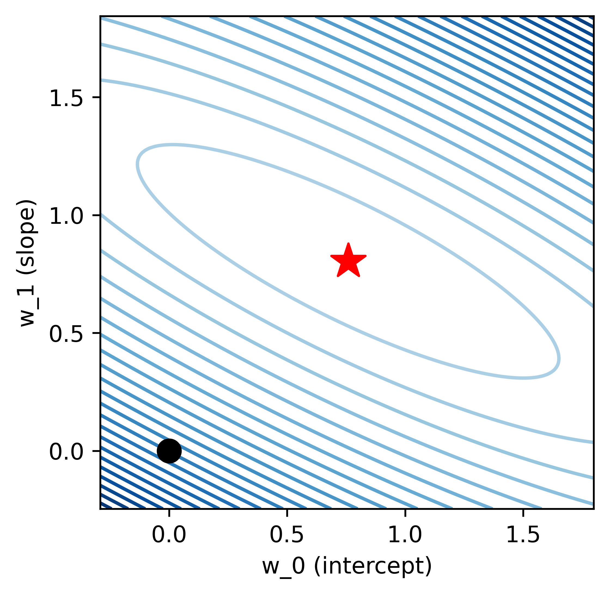

The contour plot is a representation of a 3D paraboloid in 2D. Each contour represents a z-value. The darker the blue contours are, the higher the value of the function is at those points. Because we want to minimize the cost function, we want to find the lowest point on this graph, which is represented by the red star.

Key point to note here: We use gradient descent because the minimum of the cost function isn't known. I'm only displaying the red star because this is a stylized example.

The black point represents our starting point, where the two weights are both zero.

Visually, Gradient descent is bringing us from the black point to the red star. This graph outlines the steps the algorithm takes at each iteration.

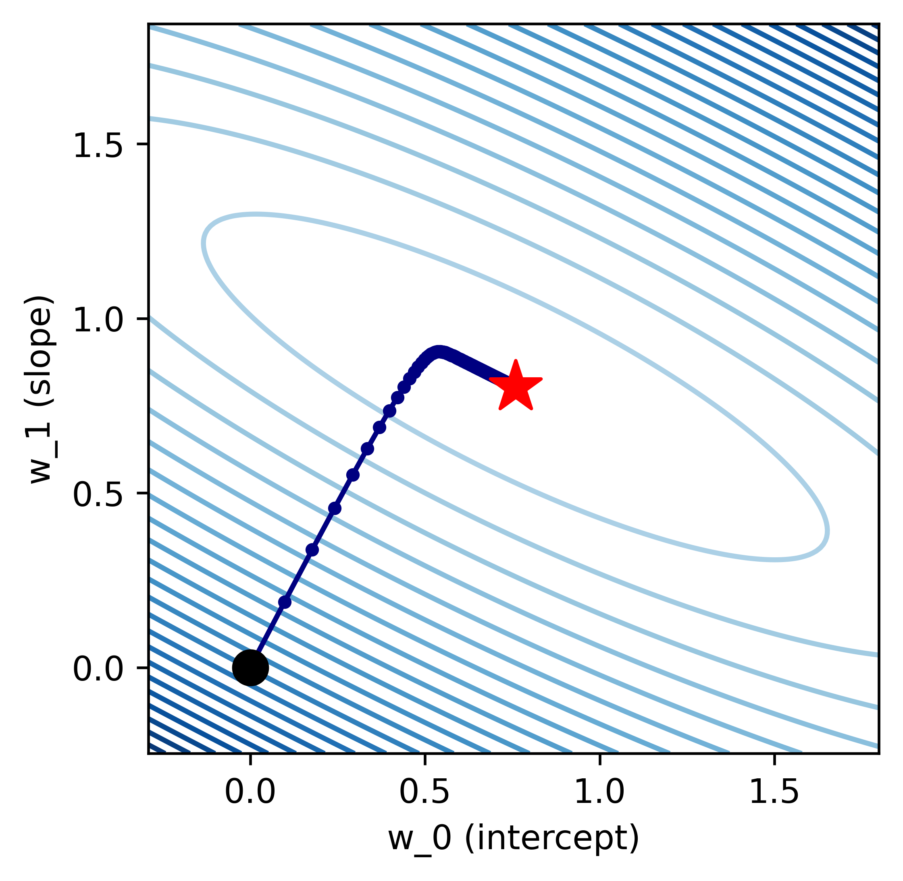

Each navy blue dot represents the weights after an iteration. We can see as the error starts to decrease (the color of the contours start to faint), the size of each step is also decreasing.

If you look at the gradient descent equation, this makes sense; After each step, we're multiplying $$\tau$$ by a smaller value because $$Xw^{(k)}-y$$ is decreasing as we get closer to the star.

A natural question to ask is: why doesn't the algorithm take us straight from the black point to the minimum? We have to recall the definition of the gradient: It's the vector of partial derivatives that points in the direction of steepest ascent. Meaning, when we subtract it from the weights, we can only travel in a direction that's perpendicular to the contour line we're currently on, as that's the direction that is the steepest.

Let's take a look at what the contour plot will look like when we vary $$\tau$$. This is what we get when we set $$\tau$$ to a slightly larger amount.

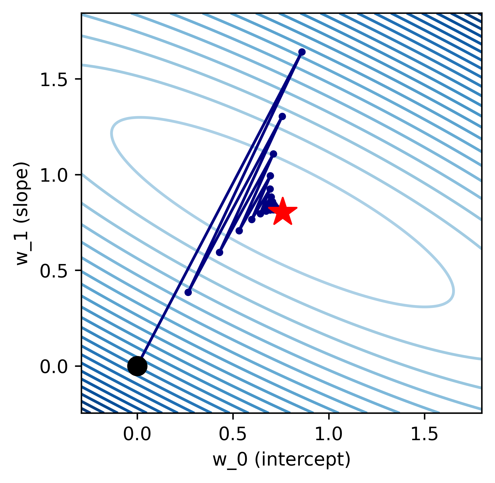

As we see here, the algorithm still converges, but it doesn't go to the minium directly. It jumps to the other side of the star repeatedly, but it still makes progress as each iteration passes.

If we increase $$\tau$$ by even more, we get the following graph:

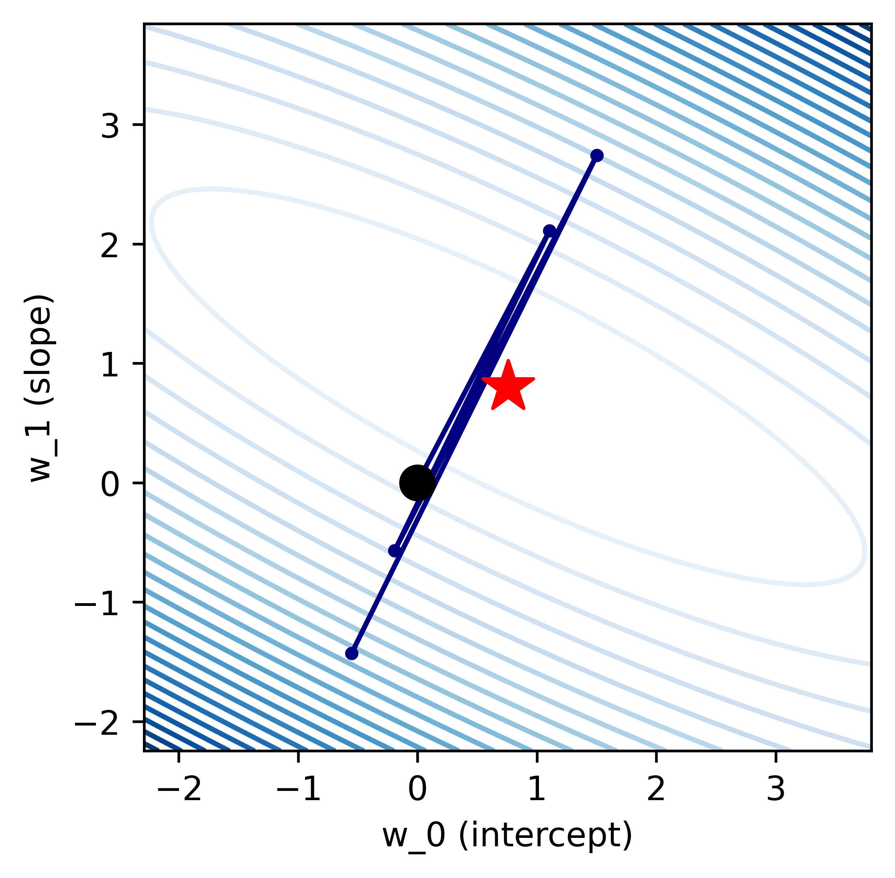

At each iteration, the algorithm is getting further and further away from the minimum.

Since $$\tau$$ is too large, the algorithm is stepping past the minimum, resulting in a larger error than the starting point. This leads to an even larger step taken for the next one. As we can see, the algorithm will never reach the minimum; It'll go on forever without converging.

And if we have tau be incredibly small, the algorithm will take forever to converge.

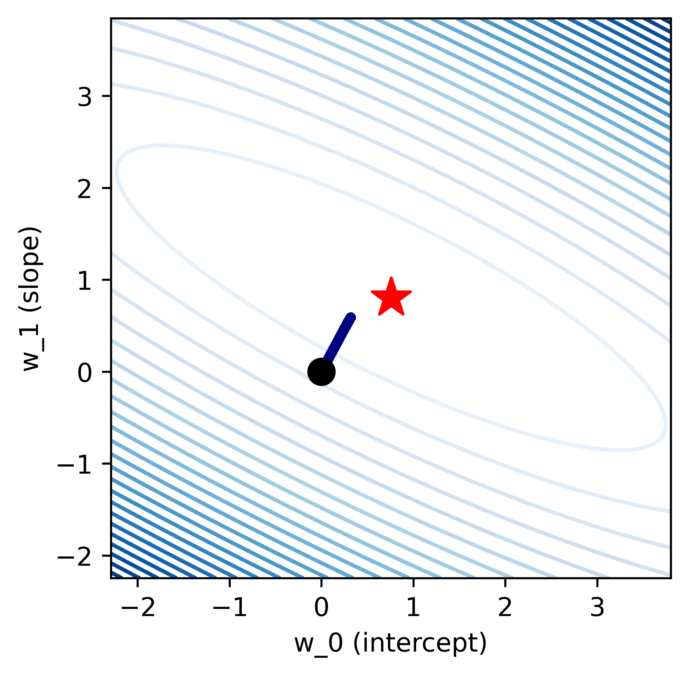

The exact values of $$\tau$$ for each of these above cases will vary based on the dataset.

Just to visualize the contour plot with what each iteration is doing exactly, I've inserted an animation with the line that we're trying to fit on the left and the contour plot on the right.

As the line becomes a better fit for the data, the weights travel closer and closer to the minimum.

<video playsinline autoplay muted loop>
    <source src="../assets/images/lr/contourplotwithline.mp4" type="video/mp4">
</video>

I hope this gave a deeper peek into what the black box of machine learning holds! ML is an ever expansive topic and this blog post barely grazes the surface of it. Please reach out if you have any questions or comments.
